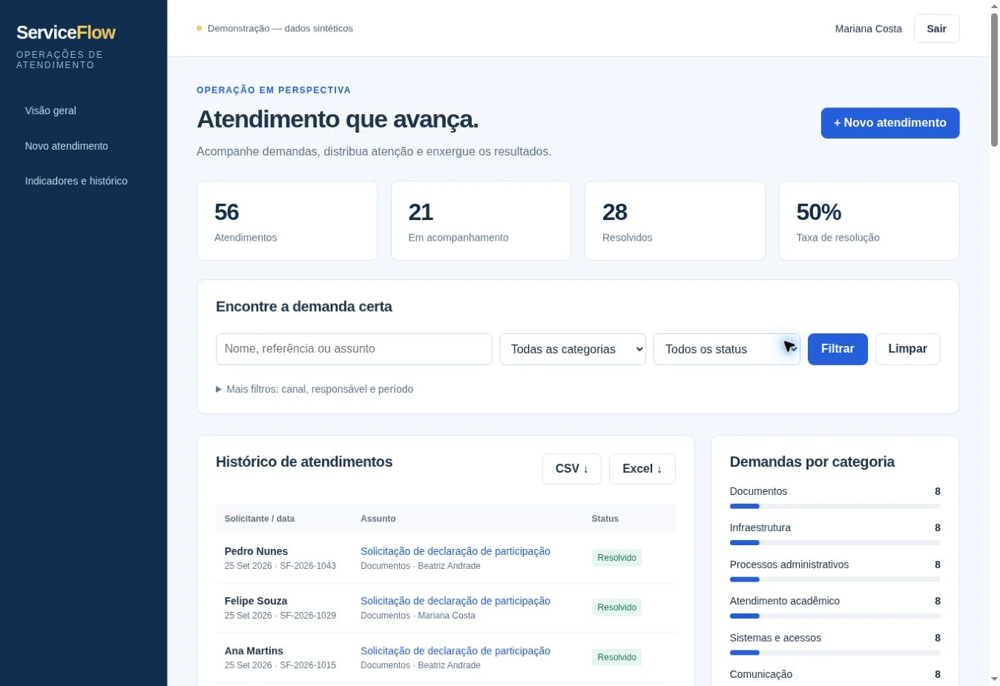

# ServiceFlow

### Do atendimento operacional ao indicador gerencial

Edição pública de portfólio com dados inteiramente sintéticos. O código não depende de sistemas originais, bases institucionais ou informações pessoais.

**Stack:** Django · PostgreSQL · OpenPyXL · Analytics

## O produto

Busca e filtros combinados; indicadores; registro e detalhe do atendimento; histórico; exportação CSV e Excel.

## Demonstração

Ative `PORTFOLIO_DEMO=1` **somente em um banco dedicado**. O acesso é feito pelo botão da tela inicial; não há senha pública nem acesso administrativo privilegiado.

56 atendimentos, 7 categorias, 4 responsáveis e diferentes canais e status.

[**Abrir demonstração**](https://rn-serviceflow-demo.vercel.app) · [Portfólio visual](https://rn-dev-portfolio-orcin.vercel.app)



Publicado na Vercel com PostgreSQL Neon dedicado. Fluxos principais verificados no navegador em 25/09/2026, incluindo gravação e leitura entre requisições. A primeira abertura após inatividade pode levar alguns segundos.

Entrada: **Explorar atendimento**, como Mariana Costa. Exportações CSV e Excel seguem os filtros ativos.

## Execução local

```bash
python -m venv .venv
source .venv/bin/activate
pip install -r requirements.txt
export SECRET_KEY="$(python -c 'import secrets; print(secrets.token_urlsafe(48))')"
export PORTFOLIO_DEMO=1
export DEBUG=1
python manage.py migrate
python manage.py seed_demo
python manage.py runserver
```

Os bancos locais são ignorados pelo Git. `seed_demo` é idempotente: executá-lo novamente não duplica a base. Para restaurar uma demonstração, use um **novo banco vazio dedicado**, execute as migrations (Django) e repita a carga; não execute reset em uma base de produção.

## Publicação na Vercel

O arquivo `vercel.json` usa a integração nativa Python da Vercel. `demo_build.py` prepara o schema e executa a carga idempotente de dados sintéticos em cada build. Configure exclusivamente no ambiente da plataforma:

- `PORTFOLIO_DEMO=1`
- `SECRET_KEY`: valor aleatório próprio desta implantação
- `DATABASE_URL`: PostgreSQL dedicado, com TLS
- `DEBUG=0`
- `ALLOWED_HOSTS`: hostname exato da implantação
- `CSRF_TRUSTED_ORIGINS`: origem HTTPS exata

O build executa a carga inicial automaticamente quando `PORTFOLIO_DEMO=1`. A integração Git publica os commits de `main`; o GitHub Actions executa a suíte de testes. A aplicação recusa execução na Vercel sem banco persistente e chave de sessão. Não use SQLite no filesystem temporário da hospedagem.

## Limites da demo

- Painel administrativo bloqueado e contas demonstrativas sem privilégios perigosos.
- Dados de exemplo identificados como sintéticos; visitantes devem usar apenas conteúdo fictício.
- Novos uploads bloqueados.
- Operações de escrita limitadas; os registros-base permanecem disponíveis.
- CSRF e headers de segurança ativos.
- Não é um ambiente de produção nem um serviço para informações confidenciais.

## Validação

```bash
python manage.py test
```

Testes de autorização, CSRF, integridade dos dados demonstrativos e fluxos principais. Dependabot e GitHub Actions preservados.

Consulte [SECURITY.md](SECURITY.md). Nunca faça commit de `.env`, tokens, bancos, exports ou credenciais.
